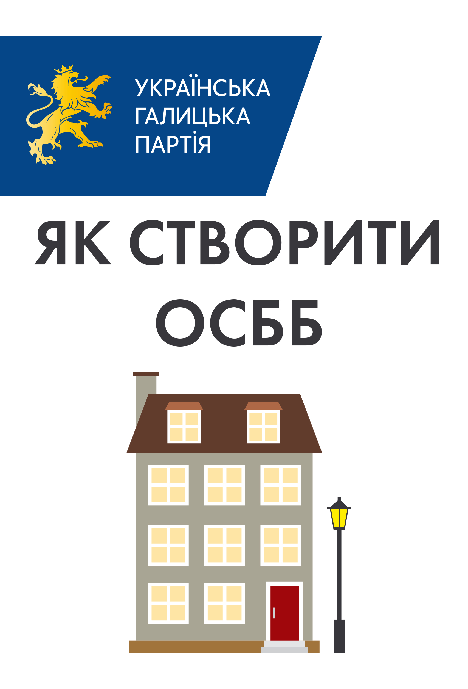
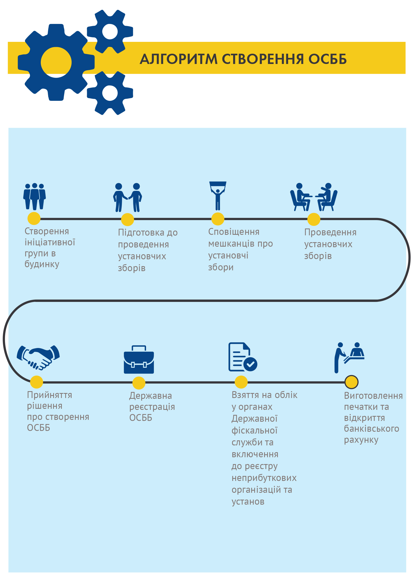

# Довідник «Як створити ОСББ?»

### НОРМАТИВНО-ПРАВОВЕ РЕГУЛЮВАННЯ

* Конституція України;
* Цивільний кодекс України ( № 435-IV від 16 січня 2003 р.);
* Закон України «Про об’єднання співвласників  багатоквартирного будинку (№ 2866-III від 29.11.2001р.в редакції від 01.07.2015);
* Закон України «Про особливості здійснення права власності у багатоквартирному будинку ( № 417-VIII від 14.05.2015р.);
* Закон України «Про державну реєстрацію юридичних осіб та фізичних осіб – підприємців» (№ 755-IV від 15.05.2003р. в редакції від 01.01.2016р.);
* Порядок надання інформації з Державного реєстру речових прав на нерухоме майно, затверджений Постановою КМУ від 25.12.2015р. № 1127 

### КОРИСНІ РЕСУРСИ

* Інформаційний ресурс для співвласників багатоквартирних будинків – http://www.osbb-inform.com.ua  
* Твоє ОСББ - http://www.tvoeosbb.com.ua/programa-pidtrimky/ 
* Телепрограма “Твій дім” (щонеділі о 11:10 год на телеканалі UA:ПЕРШИЙ) - http://www.merp.org.ua/index.php?lang=uk&Itemid=1043
* Сайт Державного агенства з енергоефективності та енергозбереження України - http://www.saee.gov.ua
* Сайт Міністерства регіонального розвитку, будівництва та житлово-комунального господарства України - http://www.minregion.gov.ua
* Сайт Львівської міської ради - програми з енергозбереження, якими можна скористатися - http://www.city-adm.lviv.ua/portal/osbb/programi-z-energozberezhennya-yakimi-mozhna-skoristatisya
* Сайт ОСББ-online – інформаційно-довідкова система - https://osbb.ck.ua/

### ПЕРЕВАГИ ОСББ

* Прозорі витрати і постійний контроль за якістю житлово-комунальних послуг.
* Розумне та спільне господарювання всіма співвласниками багатоквартирного будинку.
* Кінець «комунальних війн».
* Підвищення якості ремонтних робіт.
* Зростання рівня відповідальністі кожного мешканця.
* Спеціальні державні, міські програми та програми спонсорів, які діють для сприяння розвитку ОСББ.

### ОСНОВНІ РИЗИКИ, ЯКІ УСКЛАДНЮЮТЬ СТВОРЕННЯ ОСББ

* Відсутність у мешканців багатоквартирних будинків свідомості відповідального власника, (який розуміє, що власність – це не тільки права, але й обов’язки!)
* Невідомість - відсутність позитивних прикладів діяльності успішних ОСББ;
* Недовіра мешканців до майбутнього (ще не обраного) правління ОСББ, побоювання щодо справедливості розподілу коштів членів ОСББ;
* Незадовільний технічний стан житлових будинків, який щороку погіршується.

# АЛГОРИТМ СТВОРЕННЯ ОСББ

## СТВОРЕННЯ ІНІЦІАТИВНОЇ ГРУПИ

Ініціативна група - це не менш як три власники квартир або нежитлових приміщень у багатоквартирному будинку, які добровільно на громадських засадах беруть на себе обов’язки: 

* вивчення законодавчих підстав й економічних особливостей діяльності ОСББ;
* проведення інформаційно-роз’яснювальної роботи серед інших співвласників;
* скликання установчих зборів; 
* підготовки проектів документів для розгляду на установчих зборах (статуту ОСББ, протоколу установчих зборів тощо). 

Звертаємо увагу на те, що до складу ініціативної групи мають право ввійти лише власники квартир або нежилих приміщень у багатоквартирному будинку, тож квартиронаймачі й орендарі не можуть бути ініціаторами створення ОСББ. Виняток — якщо власник орендованої квартири видав їм відповідну довіреність.

Закон не вимагає, однак рекомендуємо для документального підтвердження повноважень членів ініціативної групи та затвердження плану її роботи оформити Протокол зі створення ініціативної групи для реєстрації  об’єднання  співвласників багатоквартирного будинку за адресою:___________.

## ПІДГОТОВКА ДО ПРОВЕДЕННЯ УСТАНОВЧИХ ЗБОРІВ

### Створення реєстру співвласників

Для подальшої ефективної роботи ОСББ ініціативній групі необхідно сформувати реєстр співвласників багатоквартирного будинку – власників квартир та нежитлових приміщень. 
Отримати інформацію про те, на скільки квартир і нежитлових приміщень у вашому будинку права власності зареєстровано в установленому законом порядку та хто саме є власниками квартир у такому будинку,  можна з різних джерел. До прикладу, такими можуть бути:

* співласники житлових та нежитлових приміщень; 
* Державний реєстр речових прав на нерухоме майно (держреєстратор, нотаріус, кабінет електронних сервісів: www.kap.minjust.gov.ua;
* місцеве БТІ (бюро технічної інвентаризації) - до 01.01.2013р.

Перший і найпростіший спосіб отримання необхідної інформації – запитати самих співвласників. Попросити їх надати відомості про правовстановлюючі документи на квартиру чи нежитлове приміщення та дані про їх загальну площу.  
Відповідно до Порядку надання інформації з Державного реєстру речових прав на нерухоме майно, затвердженого Постановою КМУ від 25.12.2015р. № 1127, інформація з Державного реєстру прав надається у паперовій або електронній формі, що має однакову юридичну силу та містить обов’язкове посилання на Державний реєстр прав.  
Таку інформацію у паперовій формі надає уповноважена особа суб’єкта державної реєстрації прав, нотаріус або його помічник. Для цього реєстратору чи нотаріусу слід подати відповідну заяву. Бланк заяви та вимоги щодо його заповнення можна знайти на офіційному сайті Міністерства юстиції України (http://ddr.minjust.gov.ua).  
Інформація з Державного реєстру прав в електронній формі надається через веб-портал Мін’юсту. 
	
Звертаємо увагу, що за надання інформації з Державного реєстру прав передбачена оплата у розмірі, встановленому Кабінетом Міністрів України.  
Також інформаційну довідку з реєстру можна отримати в Кабінеті електронних сервісів за цим посиланням: https://kap.minjust.gov.ua. Для входу використовується обліковий запис mail.gov.ua, тож необхідно попередньо зареєструватися на сайті Державної електронної пошти, яку й надалі можна використовувати для отримання документів, замовлених онлайн.

### Підготовка Статуту

Одночасно з прийняттям рішення про створення ОСББ установчі збори затверджують його статут, відтак рекомендуємо проект цього документа підготувати заздалегідь. 
Статут є установчим документом ОСББ і складається відповідно до типового статуту, затвердженого Міністерством регіонального розвитку, будівництва та житлово-комунального господарства у редакції наказу 23.09.2015  № 238 (http://www.zakon3.rada.gov.ua/laws/show/z1220-15/paran6#n6).

Звертаємо увагу, що Державний реєстр речових прав на нерухоме майно містить дані, які були внесені до нього з 1 січня 2013 року. У ньому може бути відсутня інформація про співвласників, які набули майнових прав до цієї дати.

У статуті ОСББ має бути визначено:

* Назва і місцезнаходження об’єднання
* Мета створення, завдання та предмет діяльності об’єднання
* Статутні органи  об’єднання, їхні повноваження та порядок формування
  * порядок скликання та проведення загальних зборів
  * періодичність проведення зборів
  * порядок голосування на зборах та прийняття рішень на них
  * перелік питань,  для  вирішення  яких  потрібна кваліфікована більшість голосів
* Джерела фінансування,  порядок використання майна  та коштів об’єднання
* Порядок прийняття кошторису, створення та використання фондів об’єднання,  включаючи резервні, а також порядок оплати спільних витрат
* Перелік питань, які можуть вирішуватися зборами представників
* Права і обов’язки співвласників
* Відповідальність за  порушення  статуту та рішень статутних органів
* Порядок внесення змін до статуту
* Підстави та порядок ліквідації, реорганізації (злиття, поділу) об’єднання і вирішення майнових питань, пов’язаних з цим

Статут може містити й інші положення, які є важливими для діяльності  об’єднання та не суперечать вимогам законодавства. Наприклад, у статуті можна:

* установити інший порядок визначення кількості голосів, що належать кожному співвласнику на загальних зборах; 
* доповнити перелік прав та обов’язків співвласників;
* установити термін, на який обирають членів правління та ревізійної комісії (ревізор); 
* передбачити можливість залучення працівників (на платній основі).

Звертаємо увагу! Статут ОСББ підписує голова установчих зборів або інша уповноважена зборами особа, і він не потребує нотаріального засвідчення.

### Підготовка Протоколу установчих зборів 

Рішення співвласників про створення ОСББ оформлюється відповідним Протоколом установчих зборів, тому рекомендуємо підготувати проект Протоколу завчасно.

### Cповіщення мешканців про установчі збори

Визначившись із датою проведення установчих зборів, ініціативна група зобов’язана проінформувати кожного співвласника про це не менш ніж за 14 днів. 

Повідомлення потрібно скласти в письмовій формі і вручити  кожному співвласнику:

* «особисто в руки» під розписку
* шляхом поштового відправлення (рекомендованим листом)

У повідомленні про проведення  установчих  зборів потрібно зазначити:
* з  чиєї  ініціативи скликають збори, 
* місце і час проведення зборів, 
* проект порядку денного.

Час і  місце  проведення  обирають так, щоб це було зручно для більшості можливих учасників зборів.
Повідомлення про проведення установчих зборів доцільно також розмістити на дошці для оголошень у місцях загального користування в багатоквартирному будинку

## ПРОВЕДЕННЯ УСТАНОВЧИХ ЗБОРІВ

Установчі збори веде голова зборів, якого  більшістю голосів обирають присутні співвласники або їхні представники.

### Правила голосування

1. Поіменне голосування.
2. Кожен співвласник (або його представник) має кількість голосів, пропорційну до частки загальної площі квартири або нежитлового приміщення співвласника в загальній площі всіх квартир та нежитлових приміщень, розташованих у багатоквартирному будинку.
3. Якщо одна особа є власником квартир (квартири) та/або нежитлових приміщень, загальна площа яких становить більш як 50 відсотків загальної площі всіх квартир та нежитлових приміщень багатоквартирного будинку, то кожен співвласник на установчих зборах має один голос, незалежно від кількості та площі квартир або нежитлових приміщень, що перебувають у його власності.
4. Рішення  вважається  прийнятим,  якщо  за нього проголосувало більше половини загальної кількості всіх співвласників.
5. Рішення оформлюють особистим підписом кожного, хто проголосував, із зазначенням результату голосування («за» чи «проти»).
6. Якщо в результаті проведення установчих зборів для прийняття рішення не набрали необхідної кількості голосів «за» або «проти», проводять письмове опитування тих співвласників, які не голосували на установчих зборах.
   Письмове опитування співвласників ініціативна група та інші співвласники (за бажанням) проводять упродовж 15 календарних   днів  з  дати  проведення  установчих  зборів.
   Ініціативна група готує листки опитування, у яких формує одне чи декілька питань одночасно. Співвласникам, які не голосували на установчих зборах, потрібно власноруч заповнити отримані листки опитування, тобто зазначити:
   * День опитування
   * Прізвище, ім’я, по батькові співвласника
   * Документ, що підтверджує право власності на квартиру або нежитлове приміщення
   * Номер квартири або нежитлового приміщення та їх загальна площа
   * Документ, що надає повноваження на голосування від імені співвласника (для представників)
   * Відповідь співвласника на питання “так”, “ні” або “утримався”
   * Особистий підпис співвласника та особи, яка проводила опитування
Листки письмового опитування співвласників пронумеровують, прошнуровують та додають до протоколу установчих зборів.
7. За результатами письмового опитування співвласників, особи, які його проводили, вносять результати опитування до протоколу установчих зборів та підбивають загальні підсумки голосування щодо всіх питань.  
Під час підрахунку голосів враховують і голоси, подані співвласниками на установчих зборах, і голоси співвласників, отримані під час проведення письмового опитування. Приклад:

   > Загальна площа квартир і нежитлових приміщень у будинку - 4000 кв.м. 
   > Загальна кількість співвласників – 40.
   > Голосували «ЗА»:  
   > під час установчих зборів - 15 співвласників, яким належить 1760 кв.м. (44% голосів);
   > письмове опитування - 10 співвласників, яким належить 1225 кв.м. (30,6% голосів);
   > 1760 кв.м. + 1225 кв.м. = 2985 кв.м. (44%  + 30,6% = 74,6%)
   > РІШЕННЯ ПРИЙНЯТО!
8. Якщо після проведення установчих зборів та письмового опитування необхідну кількість голосів «за» не набрано, то рішення вважається не прийнятим.

Звертаємо увагу, що право голосування на установчих зборах має власник квартири/нежитлового приміщення або його представник (згідно із законом чи за довіреністю). Якщо квартира належить більш як одному співвласникові, то реалізація прав та обов’язків співвласників квартири відбувається в порядку, передбаченому законодавством для реалізації права спільної власності.

На установчих зборах потрібно також надати повноваження представнику Установчих зборів щодо державної реєстрації об’єднання.

Рішення співвласників про створення ОСББ оформлюють відповідним Протоколом установчих зборів, до якого потрібно додати:

* список співвласників, присутніх на установчих зборах; 
* відомості про результати голосування щодо кожного питання на установчих зборах;
* пронумеровані та прошнуровані листки опитування співвласників.     

Звертаємо увагу: рекомендуємо оформлювати Протокол установчих зборів одразу у двох оригінальних примірниках, оскільки, при проведенні державної реєстрації ОСББ, один оригінал протоколу лишається в реєстратора та не повертається.

## ДЕРЖАВНА РЕЄСТРАЦІЯ ОСББ

ОСББ  вважається  утвореним з дня його державної реєстрації.

Державна реєстрація ОСББ відбувається відповідно до Закону України «Про державну реєстрацію юридичних осіб, фізичних осіб – підприємців та громадських формувань».

Державну реєстрацію ОСББ здійснюють державні реєстратори виконавчих органів сільських, селищних та міських рад, районних державних адміністрацій та нотаріуси. В обласних містах документи для проведення державної реєстрації ОСББ подаються в центри надання адміністративних послуг, у районах – до державних реєстраторів відповідної районної державної адміністрації.

ДОКУМЕНТИ, які необхідно подати уповноваженій установчими зборами особі для державної реєстрації ОСББ:

* заява про державну реєстрацію створення юридичної особи;
* статут;
* протокол установчих зборів;
* документ, що засвідчує повноваження, якщо подаються представником.

Вказані документи можна подавати державному реєстратору як особисто, так і надсилаючи їх поштовим відправленням з описом вкладення.  
Державному реєстратору для проведення державної реєстрації заборонено вимагати будь-які додаткові документи.

### Взяття на облік у органах державної фіскальної служби та включення до реєстру неприбуткових організацій та установ

Одночасно зі здійсненням державної реєстрації ОСББ, інформація про зареєстровану юридичну особу автоматично потрапляє у головне управління статистики області та Державну фіскальну службу в області, яка і вносить ОСББ до реєстру неприбуткових організацій та установ.

### Виготовлення печатки та відкриття рахунку в банку

Замовити виготовлення печатки можна в комерційних фірмах, які здійснюють такі послуги, при цьому можна на свій розсуд обрати форму, колір та напис на печатці.
Відкрити банківський рахунок ОСББ можна в будь-якій банківській установі.

## ПРИЙНЯТТЯ БУДИНКУ НА БАЛАНС

Після реєстрації ОСББ для управління своїм будинком потрібно зняти його із балансу теперішнього балансоутримувача і взяти в управління ОСББ. 

> Тут варто зазначити, що існуючий закон не передбачає потреби цього кроку, але ті ж райадмністрації, користуючись інструкціями на основі попередніх версій закону і постанов КМУ, цього вимагають. Алгоритми, описані нижче, були необхідні в травні-червні 2016 у Сихівському районі Львова.

Для того, щоб взяти свій будинок на баланс, потрібно:

1. на Загальних зборах ОСББ прийняти рішення про прийняття будинку в управління і створення комісії для цього
2. подати заяву на ім’я голови райадміністрації про призначення комісії для приймання-передачі будинку на баланс ОСББ

3. отримати розпорядження райадміністрації про створення комісії для приймання-передачі будинку на баланс ОСББ
4. на основі розпорядження разом із попереднім балансоутримувачем скласти акт приймання-передачі.
5. зареєструвати акт з п.4 (деталі згодом)

Тепер про кожен крок - детальніше.

### Рішення про прийняття будинку в управління

Загальні збори ОСББ повинні прийняти два рішення:

1. «про прийняття житлового будинку за адресою _____ в управління (на баланс) ОСББ «_____», і
2. «про створення комісії для прийняття будинку в управління ОСББ «_____».»

В комісію входять 3-4 особи з числа співвласників. Головою комісії є голова ОСББ.

*Щоб не збирати збори спеціально для цього, можна дане питання винести і проголосувати ще на Установчих зборах.*

### Заява у Райадміністрацію

У Львові заяву приймають у ЦНАП. Туди подаємо такі документи:

1. Заява на ім’я голови райадміністрації. [Приклад заяви](https://drive.google.com/open?id=0B9QTh1pp5fIfdEs4di04UTZCNms)
2. Примірник Протоколу Загальних зборів із рішенням про прийняття будинку на баланс та складом комісії.
3. Копія Статуту ОСББ.
4. Копія паспорту та ідентифікаційного коду особи, що подає заву, тобто Голови ОСББ.
5. Витяг із Держреєстру про те, що ОСББ є зареєстрованим.

### Розпорядження РА

На основі заяви із попереднього кроку, райадміністрація готує розпорядження «про утворення комісії з приймання-передачі житлового комплексу». В комісію ввійдуть особи, запропоновані ОСББ, плюс представники ЛКП, яке до того обслуговувало будинок. З цього моменту працюємо із ЛКП.

### Акт Приймання-Передачі
*В роботі*

# КОРИСНІ ПОРАДИ

#### ОСББ може скористатись різними програмами з енергозбереження

Постановою Кабінету Міністрів України від 17 жовтня 2011р. №1056 «Деякі питання використання коштів у сфері енергоефективності та енергозбереження» зі змінами передбачається відшкодування частини суми кредиту, залученого для придбання енергоефективного обладнання та/або матеріалів, зокрема, для ОСББ - на придбання енергоефективного обладнання та/або матеріалі відшкодовується 40% суми кредиту (в частині вартості матеріалів та обладнання).

Крім того, діють місцеві програми з енергозбереження. До прикладу, ухвалою Львівської міської ради № 4413 від 19.03.2015р. затверджено Програму відшкодування частини кредитів, отриманих ОСББ на впровадження заходів з енергозбереження, реконструкції і модернізації багатоквартирних будинків у м. Львові на 2015-2018 роки («Теплий дім»).  
Відповідно до цієї Програми здійснюється відшкодування частини кредитних коштів, залучених ОСББ на впровадження заходів з енергозбереження, реконструкції і модернізації багатоквартирних будинків, поліпшення комфорту мешканців міста та підвищення енергоефективності багатоквартирних будинків.  
Відшкодування частини кредиту з міського бюджету м. Львова надається ОСББ у розмірі до 30% від максимального розміру основної суми (тіла) кредиту, але не більше 100 тис. грн. за одним кредитним договором.
Програма «Теплий дім» діятиме протягом 2015-2018 років.

Детальнішу інформацію про програми з енергозбереження можна знайти  на сайті Державного агенства з енергоефективності та енергозбереження України (зазначені в розділі “ Корисні ресурси”) та на сайтах місцевих рад.

#### Порядок списання з балансу багатоквартирних будинків

Звертаємо увагу і на той факт, що Постановою Кабінету Міністрів України № 301 від 20.04.2016р. затверджено Порядок списання з балансу багатоквартирних будинків. Відповідно до даного Порядку списання з балансу багатоквартирного будинку здійснюється балансоутримувачем на підставі прийнятого ним рішення про списання багатоквартирного будинку.

Для цього утворюється відповідна комісія у складі не менше п’яти осіб, до складу якої включаються представники балансоутримувача, виконавця послуг з управління будинком або виконавця послуг з утримання будинків, споруд та прибудинкових територій такого будинку.

У роботі комісії бере участь уповноважена особа (особи) від співвласників багатоквартирного будинку за її (їх) згодою. За результатами роботи комісії складається акт про списання багатоквартирного будинку з балансу.

Для належного складення акту про списання будинку з балансу та внесення в нього реального стану будинку і всіх його технічних характеристик, рекомендуємо обов’язково обрати уповноважених осіб від ОСББ для включення їх до складу комісії.

# ЮРИДИЧНА ПІДТРИМКА

Якщо виникли будь-які запитання щодо створення ОСББ, звертайтеся за  безкоштовною консультацією фахівців та юристів:

1. Громадський офіс Української Галицької Партії  
   м. Львів, вул. К.Левицького, 20 (вхід з боку С.Палія), тел. 068-77-11-669, 276-25-96, e-mail: openuhp@gmail.com
   (плануємо переїзд в інше приміщення, тому просимо попередньо телефонувати на номер мобільного телефону).
2. Тернопільська обласна організація Української Галицької Партії
   м. Тернопіль, вул. Медова 18, оф.1, тел. 0686996032, 0673504744; ugpternopil@gmail.com
3. Івано-Франківська обласна організація Української Галицької Партії
   м. Івано-Франківськ, площа Міцкевича 8, офіс 17, тел. 066 715 45 18, 098 367 58 43, uhp.frankivsk@gmail.com
4. Ресурсні центри ОСББ органів місцевого самоврядування

---------------
 Цей твір ліцензовано за <a rel="license" href="http://creativecommons.org/licenses/by-nc-sa/4.0/">ліцензією Creative Commons Із Зазначенням Авторства - Некомерційна - Поширення На Тих Самих Умовах 4.0 Міжнародна</a>.
